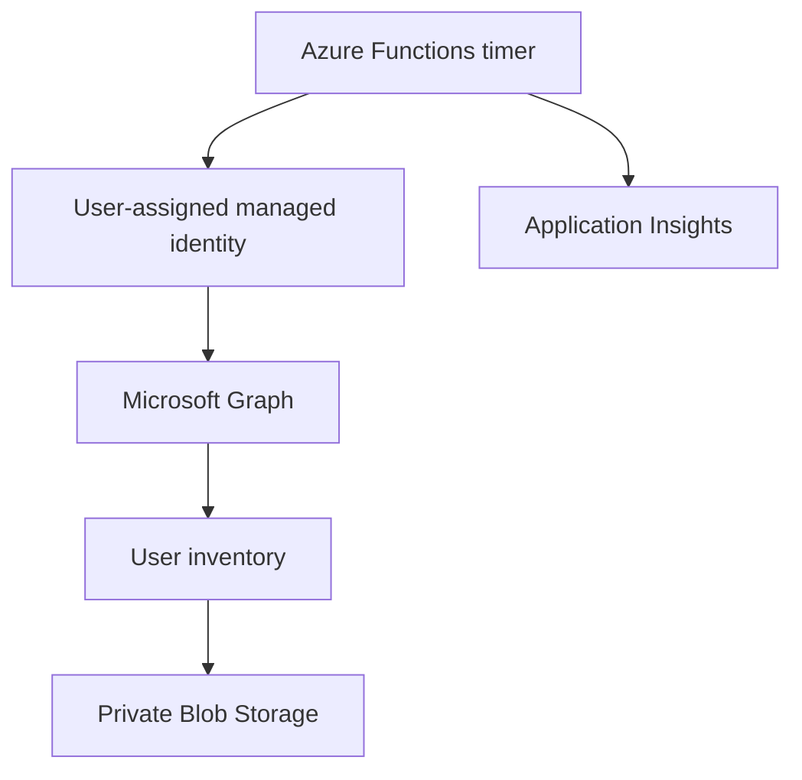

# Microsoft 365 User Inventory

[](https://github.com/eusouzati/m365-user-inventory/actions/workflows/ci.yml)

Microsoft 365 User Inventory is a Python automation project that reads users
from Microsoft Graph and exports a structured CSV inventory. It can run on a
workstation or automatically in Azure Functions.

The cloud deployment is designed to be reusable in different Microsoft 365
tenants and Azure subscriptions. Configuration is stored in one private `.env`
file, and the complete Azure environment is deployed with one command.

## Table of contents

1. [Final result](#final-result)
2. [Features](#features)
3. [Architecture](#architecture)
4. [CSV fields](#csv-fields)
5. [Security model](#security-model)
6. [Requirements](#requirements)
7. [Required permissions](#required-permissions)
8. [Install the required tools](#install-the-required-tools)
9. [Clone and prepare the project](#clone-and-prepare-the-project)
10. [Configure the env file](#configure-the-env-file)
11. [Deploy to Azure with one command](#deploy-to-azure-with-one-command)
12. [Validate the Azure deployment](#validate-the-azure-deployment)
13. [Run the inventory locally](#run-the-inventory-locally)
14. [Change the execution schedule](#change-the-execution-schedule)
15. [Deploy to another environment](#deploy-to-another-environment)
16. [Update an existing deployment](#update-an-existing-deployment)
17. [Run tests](#run-tests)
18. [Troubleshooting](#troubleshooting)
19. [Remove the Azure environment](#remove-the-azure-environment)
20. [Project structure](#project-structure)

## Final result

After a successful cloud deployment:

- Azure Functions runs the inventory every day.
- Microsoft Graph returns every user through automatic pagination.
- The Function App authenticates without a client secret.
- The latest CSV is stored in a private Azure Blob container.
- Application Insights receives execution telemetry and errors.
- The deployment can be executed again without intentionally duplicating
  resources.

Default output:

```text
Container: inventory
Blob:      m365_users.csv
Schedule:  11:00 UTC every day
```

The default schedule corresponds to 08:00 in Brasilia while UTC-3 applies.

## Features

- Microsoft Graph application authentication
- Automatic pagination for tenants with more than 100 users
- Alphabetically sorted CSV output
- UTF-8 BOM and semicolon delimiter for Excel compatibility
- Execution logs and friendly error messages
- Local authentication through an app registration
- Cloud authentication through a user-assigned managed identity
- Azure Functions Flex Consumption hosting
- Private Azure Blob Storage output
- Application Insights monitoring
- Passwordless Azure resource access
- Idempotent PowerShell deployment
- Configuration from one private `.env` file
- Automated tests on Python 3.11 and Python 3.12
- GitHub Actions continuous integration

## Architecture



Cloud authentication flow:

1. The timer starts the Azure Function.
2. `DefaultAzureCredential` selects the configured user-assigned managed
   identity.
3. The identity obtains a token for Microsoft Graph.
4. Microsoft Graph returns the Microsoft 365 users.
5. The same identity writes the generated CSV to private Blob Storage.
6. Execution details and failures are sent to Application Insights.

No Microsoft 365 client secret or storage account key is deployed to Azure.

## CSV fields

| Column | Description |
| --- | --- |
| `display_name` | User display name |
| `user_principal_name` | Microsoft 365 sign-in name |
| `email` | Primary email returned by Microsoft Graph |
| `department` | Department configured in Microsoft Entra ID |
| `job_title` | Job title configured in Microsoft Entra ID |
| `account_enabled` | Whether the account is enabled |

Empty Microsoft Entra ID attributes remain empty in the CSV.

## Security model

- `.env` is ignored by Git.
- `.env` and `.env.example` are excluded from the Azure deployment package.
- Local client credentials stay only on the local workstation.
- The cloud Function App uses managed identity.
- Storage public access is disabled.
- Storage shared-key access is disabled.
- The Blob container is private.
- Microsoft Graph access is limited to the read-only application permission
  `User.Read.All`.
- The managed identity receives `Storage Blob Data Owner` only on the inventory
  storage account.
- The signed-in deployment user receives `Storage Blob Data Reader` on the
  inventory container.
- The managed identity receives `Monitoring Metrics Publisher` on Application
  Insights.

Never commit `.env`, `local.settings.json`, generated CSV files, logs, access
tokens, keys or client secrets.

## Requirements

You need:

- A Microsoft 365 tenant
- An Azure subscription
- The Azure subscription connected to the same Microsoft Entra tenant that
  will be inventoried
- Windows PowerShell 5.1 or PowerShell 7
- Git
- Python 3.11 or 3.12
- Azure CLI
- Azure Functions Core Tools 4

The same-tenant requirement is important. The managed identity is created in
the subscription's Microsoft Entra tenant and receives the Microsoft Graph
permission in that tenant.

Official installation references:

- [Azure CLI on Windows](https://learn.microsoft.com/cli/azure/install-azure-cli-windows)
- [Azure Functions Core Tools](https://learn.microsoft.com/azure/azure-functions/functions-run-local)
- [Flex Consumption hosting](https://learn.microsoft.com/azure/azure-functions/flex-consumption-how-to)
- [Managed identity application roles](https://learn.microsoft.com/entra/identity/managed-identities-azure-resources/assign-app-role-managed-identity-azure-cli)

## Required permissions

The person running the cloud deployment needs both Azure and Microsoft Entra
permissions.

### Azure permissions

Use one of these options at subscription or resource-group scope:

- `Owner`; or
- `Contributor` together with `User Access Administrator`.

These permissions are needed because the script creates Azure resources and
Azure RBAC assignments.

### Microsoft Entra permissions

The operator must be allowed to grant Microsoft Graph application permissions
to the managed identity. A tenant administrator may be required by the tenant's
administrative policy.

The deployment grants only:

```text
Microsoft Graph application permission: User.Read.All
```

This permission requires administrator consent and allows the application to
read user profiles without a signed-in user.

## Install the required tools

### 1. Install Git

Install Git for Windows and confirm:

```powershell
git --version
```

### 2. Install Python

Install Python 3.11 or 3.12 and select the installer option that adds Python to
`PATH`. Confirm:

```powershell
python --version
```

### 3. Install Azure CLI

On a supported Windows system with WinGet:

```powershell
winget install --exact --id Microsoft.AzureCLI
```

Close and reopen PowerShell, then confirm:

```powershell
az version
```

### 4. Install Azure Functions Core Tools 4

Install Core Tools 4 by following the official Microsoft documentation. Close
and reopen PowerShell, then confirm:

```powershell
func --version
where.exe func
```

The major version returned by `func --version` must be `4`.

### 5. Confirm PowerShell

```powershell
$PSVersionTable.PSVersion
```

## Clone and prepare the project

### 1. Clone the repository

```powershell
cd C:\Projects
git clone https://github.com/eusouzati/m365-user-inventory.git
cd m365-user-inventory
```

If the repository is already cloned:

```powershell
cd C:\Projects\m365-user-inventory
git pull --rebase origin main
```

### 2. Create a virtual environment

```powershell
python -m venv .venv
.\.venv\Scripts\Activate.ps1
```

The PowerShell prompt should start with `(.venv)`.

### 3. Install Python dependencies

```powershell
python -m pip install --upgrade pip
python -m pip install -r requirements.txt
```

### 4. Run the automated tests

```powershell
python -m unittest discover -s tests -v
```

Expected result:

```text
Ran 5 tests
OK
```

## Configure the env file

### 1. Create the private file

From the repository root:

```powershell
Copy-Item .env.example .env
notepad .env
```

Do not remove `.env` from `.gitignore`.

### 2. Complete the Azure values

The minimum cloud deployment values are:

```dotenv
AZURE_TENANT_ID=00000000-0000-0000-0000-000000000000
AZURE_SUBSCRIPTION_ID=00000000-0000-0000-0000-000000000000
```

Sign in and discover these IDs:

```powershell
az login
az account show --query "{TenantId:tenantId,SubscriptionId:id,Subscription:name,State:state}" --output table
```

If more than one subscription is available:

```powershell
az account list --output table
az account set --subscription <subscription-id>
```

### 3. Complete all deployment settings

Example `.env` structure:

```dotenv
# Local Microsoft 365 authentication
M365_TENANT_ID=
M365_CLIENT_ID=
M365_CLIENT_SECRET=

# Azure target
AZURE_TENANT_ID=00000000-0000-0000-0000-000000000000
AZURE_SUBSCRIPTION_ID=00000000-0000-0000-0000-000000000000
AZURE_LOCATION=brazilsouth
AZURE_RESOURCE_GROUP=rg-m365-user-inventory

# Resource names
AZURE_STORAGE_ACCOUNT=
AZURE_FUNCTION_APP=
AZURE_MANAGED_IDENTITY_NAME=id-m365-user-inventory

# Output and schedule
INVENTORY_CONTAINER=inventory
INVENTORY_BLOB_NAME=m365_users.csv
INVENTORY_SCHEDULE=0 0 11 * * *
```

### 4. Understand every variable

| Variable | Required | Secret | Description |
| --- | --- | --- | --- |
| `AZURE_TENANT_ID` | Cloud | No | Tenant that owns the Azure subscription |
| `AZURE_SUBSCRIPTION_ID` | Cloud | No | Subscription used for deployment |
| `AZURE_LOCATION` | No | No | Flex Consumption region; default `brazilsouth` |
| `AZURE_RESOURCE_GROUP` | No | No | Resource group name |
| `AZURE_STORAGE_ACCOUNT` | No | No | Globally unique storage name |
| `AZURE_FUNCTION_APP` | No | No | Globally unique Function App name |
| `AZURE_MANAGED_IDENTITY_NAME` | No | No | User-assigned managed identity name |
| `INVENTORY_CONTAINER` | No | No | Private Blob container name |
| `INVENTORY_BLOB_NAME` | No | No | CSV Blob name |
| `INVENTORY_SCHEDULE` | No | No | Six-field NCRONTAB schedule in UTC |
| `M365_TENANT_ID` | Local | No | Tenant used for local authentication |
| `M365_CLIENT_ID` | Local | No | Local app registration client ID |
| `M365_CLIENT_SECRET` | Local | Yes | Local app registration secret value |

If `AZURE_STORAGE_ACCOUNT` and `AZURE_FUNCTION_APP` are blank, the deployment
script generates stable names from the subscription ID. Running the script
again for the same subscription generates the same names.

Storage account names must contain only lowercase letters and numbers and must
be globally unique. Function App names must also be globally unique.

### 5. Confirm that Git ignores the private file

```powershell
git check-ignore -v .env
git status
```

`.env` must not appear as an untracked file in `git status`.

## Deploy to Azure with one command

### 1. Sign in to the correct tenant

```powershell
az login --tenant <azure-tenant-id>
az account set --subscription <azure-subscription-id>
az account show --query "{User:user.name,Tenant:tenantId,Subscription:name,State:state}" --output table
```

Confirm that the tenant and subscription match `.env`.

### 2. Check that the region supports Flex Consumption

```powershell
az functionapp list-flexconsumption-locations --output table
```

Use one of the returned locations as `AZURE_LOCATION`.

### 3. Start the deployment

From the repository root:

```powershell
.\scripts\Deploy.ps1
```

The script displays the complete plan. Review the tenant, subscription,
resource group, location and resource names. Type:

```text
DEPLOY
```

For an already approved non-interactive pipeline:

```powershell
.\scripts\Deploy.ps1 -Yes
```

### 4. What the command does

The script performs these steps:

1. Reads and validates `.env`.
2. Checks Azure CLI and Azure Functions Core Tools.
3. Signs in when necessary and selects the configured subscription.
4. Confirms that the subscription belongs to the configured tenant.
5. Registers the required Azure resource providers.
6. Creates or reuses the resource group.
7. Creates or reuses the storage account.
8. Disables Blob public access and storage shared-key access.
9. Creates or reuses the user-assigned managed identity.
10. Grants the identity Blob Storage access.
11. Creates or reuses the Flex Consumption Function App.
12. Attaches the user-assigned identity to the Function App.
13. Grants the identity Application Insights telemetry access.
14. Creates or reuses the private inventory container.
15. Grants the signed-in user read-only access to the container.
16. Configures passwordless Function App settings.
17. Grants Microsoft Graph `User.Read.All` to the managed identity.
18. Publishes the Python Function project.

The script can be run again. Existing resources and role assignments are
detected and reused whenever possible.

## Validate the Azure deployment

Set local PowerShell variables using the names from `.env`:

```powershell
$rg = "<resource-group>"
$app = "<function-app>"
$storage = "<storage-account>"
```

### 1. Confirm the Function App

```powershell
az functionapp show `
    --resource-group $rg `
    --name $app `
    --query "{Name:name,State:state,Host:defaultHostName}" `
    --output table
```

Expected state:

```text
Running
```

### 2. Confirm the timer function

```powershell
az functionapp function list `
    --resource-group $rg `
    --name $app `
    --query "[].{Name:name,Language:language}" `
    --output table
```

Expected function name:

```text
m365_inventory_timer
```

### 3. Run the timer manually

This test uses the host master key only in the current PowerShell session:

```powershell
$masterKey = az functionapp keys list `
    --name $app `
    --resource-group $rg `
    --query masterKey `
    --output tsv

$headers = @{ "x-functions-key" = $masterKey }

$response = Invoke-WebRequest `
    -UseBasicParsing `
    -Method POST `
    -Uri "https://$app.azurewebsites.net/admin/functions/m365_inventory_timer" `
    -Headers $headers `
    -ContentType "application/json" `
    -Body "{}"

$response.StatusCode
Remove-Variable masterKey, headers, response
```

Expected HTTP status:

```text
202
```

HTTP `202` means that Azure accepted the execution request. Wait a short time
before checking the Blob because the function runs asynchronously.

### 4. Confirm the generated CSV

```powershell
az storage blob list `
    --account-name $storage `
    --container-name inventory `
    --auth-mode login `
    --query "[].{Name:name,Size:properties.contentLength,Modified:properties.lastModified}" `
    --output table
```

Expected Blob:

```text
m365_users.csv
```

### 5. Download the CSV

```powershell
New-Item -ItemType Directory -Path .\download -Force | Out-Null

az storage blob download `
    --account-name $storage `
    --container-name inventory `
    --name m365_users.csv `
    --file .\download\m365_users.csv `
    --auth-mode login `
    --overwrite
```

### 6. Check logs

Azure portal path:

```text
Function App
  > Functions
  > m365_inventory_timer
  > Invocations
```

Application Insights may take several minutes to display a new invocation.
Managed identity permission changes can also take time to propagate.

## Run the inventory locally

Local execution uses an app registration and creates the CSV on the local
computer. This is separate from managed identity cloud execution.

### 1. Create an app registration

In the Microsoft Entra admin center:

1. Open **App registrations**.
2. Select **New registration**.
3. Enter a descriptive name.
4. Select the single-tenant account option.
5. Create the registration.
6. Copy **Directory (tenant) ID**.
7. Copy **Application (client) ID**.
8. Open **API permissions**.
9. Add **Microsoft Graph** > **Application permissions**.
10. Add `User.Read.All`.
11. Grant administrator consent.
12. Open **Certificates & secrets**.
13. Create a client secret.
14. Copy the secret **Value** immediately.

Do not use the secret ID in place of the secret value.

### 2. Add the local values to `.env`

```dotenv
M365_TENANT_ID=<directory-tenant-id>
M365_CLIENT_ID=<application-client-id>
M365_CLIENT_SECRET=<client-secret-value>
```

### 3. Activate the virtual environment

```powershell
.\.venv\Scripts\Activate.ps1
```

### 4. Run the local inventory

Close the existing CSV in Excel before running:

```powershell
python src\main.py
```

Expected local files:

```text
output/m365_users.csv
logs/m365_inventory.log
```

## Change the execution schedule

`INVENTORY_SCHEDULE` uses a six-field NCRONTAB expression:

```text
second minute hour day month day-of-week
```

Examples:

| Objective | UTC schedule |
| --- | --- |
| Every day at 11:00 UTC | `0 0 11 * * *` |
| Every Monday at 12:00 UTC | `0 0 12 * * 1` |
| First day of each month at 10:00 UTC | `0 0 10 1 * *` |

Change the value in `.env` and run the same deployment command again:

```powershell
.\scripts\Deploy.ps1
```

## Deploy to another environment

Use a separate clone or a separate private `.env` for each environment.

Example development environment:

```dotenv
AZURE_RESOURCE_GROUP=rg-m365-user-inventory-dev
AZURE_STORAGE_ACCOUNT=stexamplem365dev01
AZURE_FUNCTION_APP=func-example-m365-dev-01
AZURE_MANAGED_IDENTITY_NAME=id-m365-user-inventory-dev
```

Example production environment:

```dotenv
AZURE_RESOURCE_GROUP=rg-m365-user-inventory-prod
AZURE_STORAGE_ACCOUNT=stexamplem365prod01
AZURE_FUNCTION_APP=func-example-m365-prod-01
AZURE_MANAGED_IDENTITY_NAME=id-m365-user-inventory-prod
```

Each storage and Function App name must be globally unique.

Do not commit environment-specific `.env` files. The `.gitignore` pattern
protects `.env` and `.env.*`, while keeping `.env.example` public.

## Update an existing deployment

Update the repository:

```powershell
git status
git pull --rebase origin main
.\.venv\Scripts\Activate.ps1
python -m pip install -r requirements.txt
python -m unittest discover -s tests -v
.\scripts\Deploy.ps1
```

Review local changes before pulling. Do not use destructive Git commands to
discard work you want to keep.

## Run tests

Run all tests:

```powershell
python -m unittest discover -s tests -v
```

Check Python syntax:

```powershell
python -m py_compile src\main.py function_app.py
```

Check Git whitespace:

```powershell
git diff --check
```

GitHub Actions runs the test matrix on Python 3.11 and 3.12 for every push to
`main` and every pull request.

## Troubleshooting

### `No module named azure`

The virtual environment is not active or dependencies are not installed:

```powershell
.\.venv\Scripts\Activate.ps1
python -m pip install -r requirements.txt
```

### `func` is not recognized

Install Azure Functions Core Tools 4, close PowerShell, open a new terminal and
run:

```powershell
func --version
where.exe func
```

### `Please run az login`

```powershell
az login --tenant <azure-tenant-id>
az account set --subscription <azure-subscription-id>
```

### Subscription or tenant mismatch

Compare `.env` with:

```powershell
az account show --query "{Tenant:tenantId,SubscriptionId:id,Subscription:name}" --output table
```

### Cannot create role assignments

The signed-in user needs `Owner`, or `Contributor` together with `User Access
Administrator`, at the required Azure scope.

### Cannot grant `User.Read.All`

Use a tenant administrator account authorized to grant Microsoft Graph
application permissions. Run the deployment again after the role is available.

### Function App or storage name is unavailable

Set unique values in `.env`:

```dotenv
AZURE_STORAGE_ACCOUNT=<unique-lowercase-name>
AZURE_FUNCTION_APP=<unique-function-name>
```

Then execute `Deploy.ps1` again.

### Region does not support Flex Consumption

```powershell
az functionapp list-flexconsumption-locations --output table
```

Choose one returned region and update `AZURE_LOCATION`.

### HTTP `202`, but the CSV is not visible yet

The request was accepted asynchronously. Wait a few minutes and check Function
invocations and Application Insights. New RBAC and managed identity permissions
can require propagation time.

### Blob access denied in the Azure portal

The signed-in user needs `Storage Blob Data Reader` on the inventory container.
Run the deployment again or ask an Azure administrator to grant that role.

### CSV is locked locally

Close `m365_users.csv` in Excel and run the local command again.

### Azure CLI cache daemon warning

If Git displays a cache daemon warning but the output confirms that objects were
written and the branch or tag was updated, verify with:

```powershell
git status
git log -1 --oneline
```

## Remove the Azure environment

Deleting the resource group permanently removes the Function App, managed
identity, storage account, inventory CSV and monitoring resources in that
group. Download any CSV that must be retained before continuing.

Review the exact target first:

```powershell
az resource list --resource-group <resource-group> --output table
```

Delete only when the target is confirmed:

```powershell
az group delete `
    --name <resource-group> `
    --yes `
    --no-wait
```

Microsoft Graph application-role assignments associated with a deleted managed
identity become unusable with that identity. Tenant administrators should
review enterprise application permissions according to organizational policy.

## Project structure

```text
m365-user-inventory/
|-- .github/
|   `-- workflows/
|       `-- ci.yml
|-- docs/
|   `-- DEPLOYMENT.md
|-- scripts/
|   |-- Deploy.ps1
|   |-- Deploy-AzureV5.ps1
|   `-- New-LabUsers.ps1
|-- src/
|   `-- main.py
|-- tests/
|   `-- test_main.py
|-- .env.example
|-- .funcignore
|-- .gitignore
|-- function_app.py
|-- host.json
|-- local.settings.example.json
|-- requirements.txt
`-- README.md
```

## Version

Version 1.2.0 - portable one-command Azure deployment with detailed setup,
validation, security and troubleshooting instructions.

## License

This project is licensed under the [MIT License](LICENSE).

Copyright (c) 2026 Tiago de Souza Silva.

Author: [Tiago de Souza Silva](https://www.linkedin.com/in/eusouzati/)
